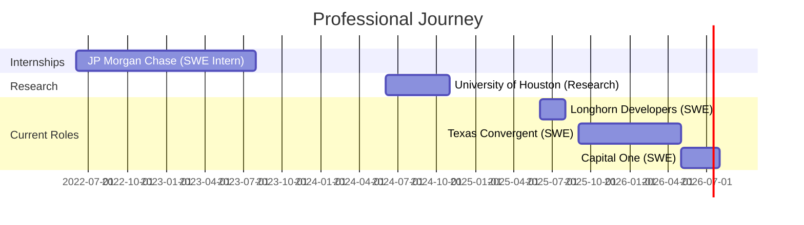

<!-- Guitar-Themed Animated Header -->

<!-- Dynamic Intro with Guitar Motif -->

<!-- Social Badges -->
 

 

## 🎸 About Me

<table>
<tr>
<td width="50%">

### 🎯 Snapshot

**Currently Building @**
- Texas Convergent (Forge team) → Real-time ad analytics
- AI depth perception for hot-swappable image generation
- Cursor for DAWs (Custom MCP server for DAW plugins)

**Previously @**
- JP Morgan Chase (2x)
- University of Houston Research
- Longhorn Developers

**Incoming @**
- Capital One

**Technical Focus**
> Backend pipelines, ontological data routing, scalable infrastructure

**When I'm Not Coding**
> Shredding electric guitar riffs 🎸

</td>
<td width="50%">

### 🏆 Recognition

**Palantir Hackathon @ UT Austin**
- 🥉 3rd Place out of 80+ teams
- Built autonomous RAG scraping service
- 98% ontology data labeling accuracy

**TSA National Conference**
- 🏅 9th Place Nationally (Top 0.012%)
- 750+ projects, 1,000+ competitors
- AI-powered disease diagnosis system
- 97% prediction accuracy across 35+ diseases

**Dulles VikeBytes**
- Organized district-wide hackathon as CS Club President
- Collaborated with GirlBytes to spread awareness
- Led team of 15 officers to host event
- 50+ competitors, $300+ revenue, 8 planning months

</td>
</tr>
</table>

## 💼 Experience Timeline

## 🔥 Featured Work

| 🚀 Project | 💡 Innovation | 🛠️ Stack | 📊 Impact |
|:-----------|:--------------|:----------|:----------|
| **Texas Convergent - AdTalk** | Real-time audio streaming with Whisper AI for advertisement detection. Autonomous data processing pipeline with GCS, Supabase, and Python, served to a React dashboard | `Python` `React` `Supabase` `GCP` `OpenAI` | 42% accuracy boost, 3x query speed |
| **DetectFX Studio** | Smart amplifier emulator with GPU-accelerated RNNs. Reverse-engineered proprietary DSP modularity algorithms | `Python` `FastAPI` `React` `ML` | 400+ users, 90% audio deconstruction accuracy |
| **CoffeeChat (Palantir)** | Autonomous RAG scraper with NLP partitioning | `Python` `FastAPI` `NextJS` `Foundry` | 3rd/80+, 98% labeling accuracy |
| **Longhorn Developers - Mobilize UT** | Crowd-sourced campus accessibility routing system | `TypeScript` `React Native` `Expo` `Supabase` | 10K+ queries, <100ms response |
| **KGK Diagnosis** | Multi-model disease prediction system | `Python` `Streamlit` `HuggingFace` | 9th nationally, 97% accuracy |
| **DormMatch** | Semantic search engine for UT dorm matching | `Python` `FastAPI` `React` `NLP` | 300+ students matched |

## 🎯 Tech Stack

### Languages

### Frameworks & Libraries

### Tools & Platforms

### Specializations

## 📊 GitHub Statistics

## 🎸 Beyond the Code

When I'm not architecting backend systems or optimizing ML pipelines, you'll find me:
- 🎸 Shredding on my electric guitar
- 🎵 Researching amplifier emulator software
- 🌆 Rewatching Cyberpunk Edgerunners
- 🔱 Reading Percy Jackson (for the 9th time)
- 📚 Learning about digital signal processing

> *"Dad, what are clouds made of? Linux servers, mostly."*

### 🚀 Currently Working On
**Real-time AI Systems** • **Scalable Infrastructure** • **LLM Optimization**

  
  

⚡ Fun fact: I have been to Lego Land and Lego World!

